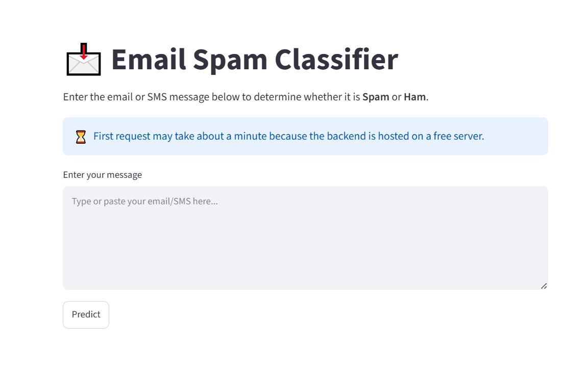
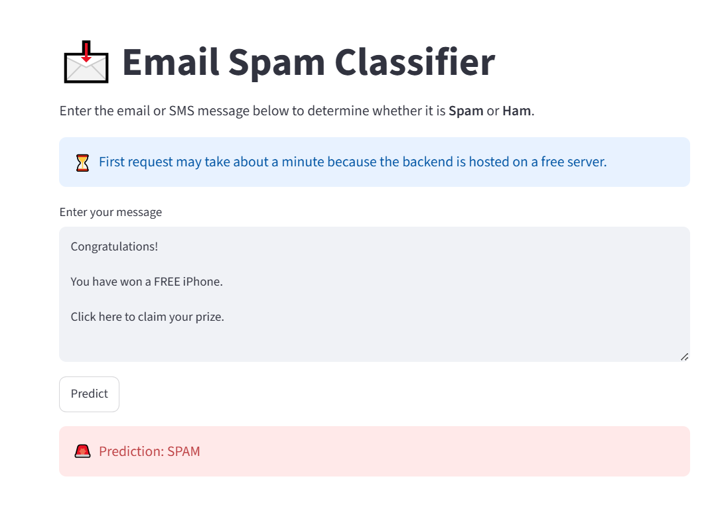
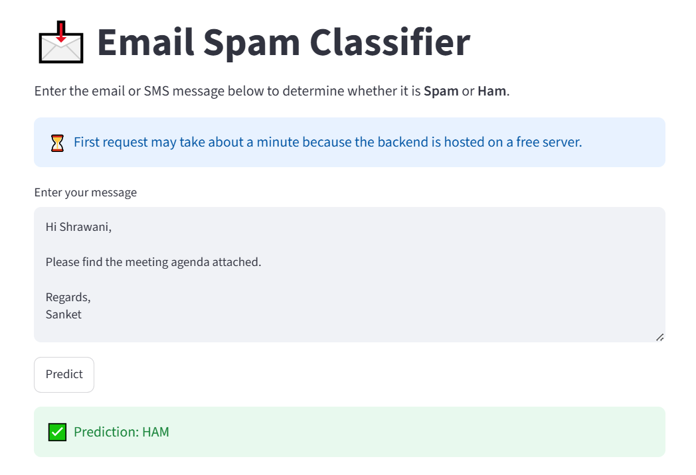
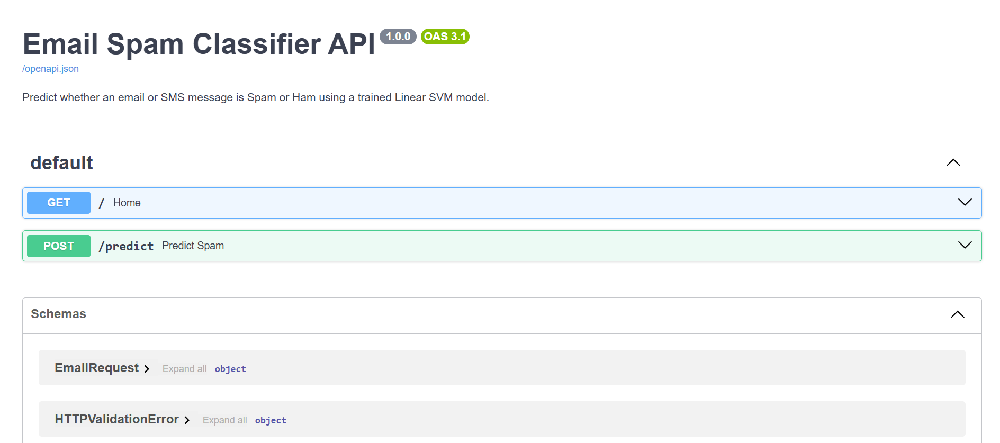
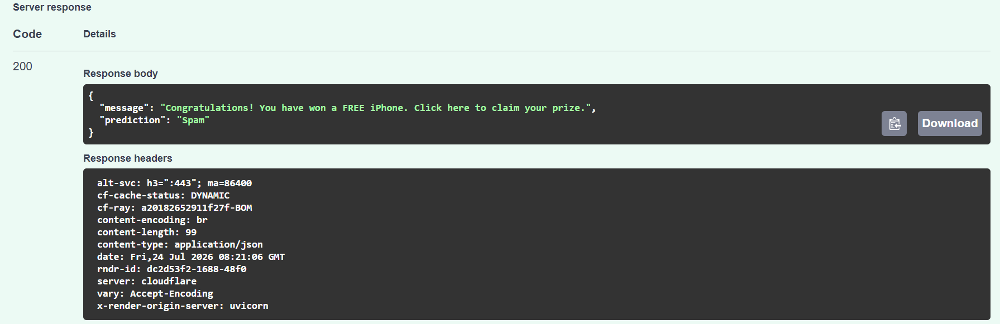
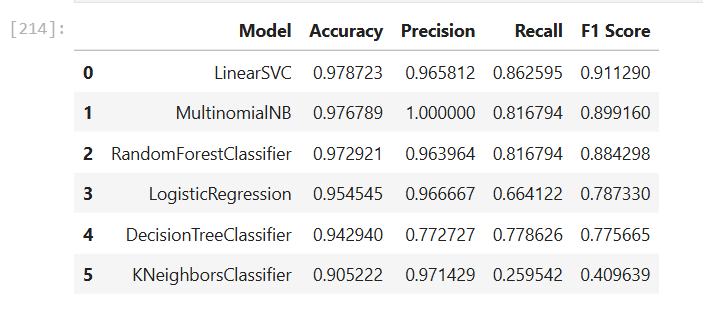

# 📧 Email Spam Classifier using NLP | Linear SVM | FastAPI | Streamlit | Docker

## 📌 Project Overview

Email spam continues to be one of the most common cybersecurity and communication challenges. This project presents an end-to-end Machine Learning solution that automatically classifies email/SMS messages as **Spam** or **Ham (Not Spam)** using Natural Language Processing (NLP).

The project includes complete data preprocessing, exploratory data analysis (EDA), feature engineering using **TF-IDF**, comparison of multiple machine learning algorithms, and deployment using **FastAPI** and **Streamlit**. The application is containerized with Docker and is deployment-ready.

---

## 🎯 Problem Statement

The objective of this project is to develop an intelligent spam detection system capable of automatically identifying spam messages while minimizing false positives. The solution helps improve communication security and reduces manual effort in filtering unwanted messages.

---

# 🚀 Features

- End-to-End Machine Learning Pipeline
- Exploratory Data Analysis (EDA)
- NLP Text Preprocessing
- TF-IDF Feature Extraction
- Comparison of Multiple Machine Learning Models
- Linear Support Vector Machine (Linear SVM) Classifier
- REST API using FastAPI
- Interactive Streamlit Web Application
- Dockerized Application
- Deployment Ready

---

# 📊 Dataset

- **Dataset:** SMS Spam Collection Dataset
- **Total Messages:** 5,169
- **Ham Messages:** 4,516
- **Spam Messages:** 653

---

# 🔍 Exploratory Data Analysis

The following analyses were performed before model training:

- Missing Value Analysis
- Duplicate Record Detection
- Class Distribution
- Message Length Analysis
- Word Count Analysis
- Punctuation Analysis
- Word Cloud Visualization
- Most Frequent Spam Words
- Most Frequent Ham Words

---

# 🧹 NLP Preprocessing Pipeline

Each message passes through the following preprocessing pipeline:

```
Raw Text
    │
    ▼
Convert to Lowercase
    │
    ▼
Tokenization
    │
    ▼
Remove Special Characters
    │
    ▼
Remove Stopwords
    │
    ▼
Stemming
    │
    ▼
TF-IDF Vectorization
```

---

# 🤖 Machine Learning Models Compared

The following algorithms were evaluated:

| Model | Accuracy | Precision | Recall | F1 Score |
|--------|---------:|----------:|-------:|---------:|
| Multinomial Naive Bayes | 97.68% | 100.00% | 81.68% | 89.92% |
| Logistic Regression | 95.45% | 96.67% | 66.41% | 78.73% |
| Random Forest | 97.29% | 96.40% | 81.68% | 88.43% |
| Decision Tree | 94.29% | 77.27% | 77.86% | 77.57% |
| K-Nearest Neighbors | 90.52% | 97.14% | 25.95% | 40.96% |
| **Linear SVM ⭐ (Selected Model)** | **97.87%** | **96.58%** | **86.26%** | **91.13%** |

### Why Linear SVM?

Although Multinomial Naive Bayes achieved slightly higher precision, **Linear SVM** achieved the best overall balance between **Accuracy**, **Recall**, and **F1-Score**, making it the preferred model for this spam classification task.

---

# 🏗️ Project Architecture

```
                User
                  │
                  ▼
          Streamlit Web App
                  │
           HTTP POST Request
                  │
                  ▼
             FastAPI Backend
                  │
                  ▼
      NLP Preprocessing Pipeline
                  │
                  ▼
        TF-IDF Feature Extraction
                  │
                  ▼
      Linear SVM Prediction Model
                  │
                  ▼
        Spam / Ham Prediction
```

---

# 🛠️ Tech Stack

## Programming Language

- Python

## Machine Learning

- Scikit-learn
- Pandas
- NumPy

## Natural Language Processing

- NLTK
- TF-IDF Vectorizer

## Backend

- FastAPI
- Uvicorn

## Frontend

- Streamlit

## Model Serialization

- Joblib

## Deployment

- Docker
- Render

## Version Control

- Git
- GitHub

---

# 📂 Project Structure

```text
Email_Spam_Classifier/
│
├── app/
│   ├── __init__.py
│   ├── main.py
│   └── preprocessing.py
│
├── model/
│   ├── linear_svm_model.pkl
│   └── tfidf_vectorizer.pkl
│
├── notebook/
│
├── streamlit_app.py
├── requirements.txt
├── Dockerfile
└── README.md
```

---

# ⚙️ Run Locally

## Clone Repository

```bash
git clone <repository-url>
cd Email_Spam_Classifier
```

## Install Dependencies

```bash
pip install -r requirements.txt
```

## Run FastAPI

```bash
uvicorn app.main:app --reload
```

Open:

```
http://127.0.0.1:8000/docs
```

---

## Run Streamlit

```bash
streamlit run streamlit_app.py
```

---

# 🐳 Docker

## Build Docker Image

```bash
docker build -t spam-classifier .
```

## Run Docker Container

```bash
docker run -p 8000:8000 spam-classifier
```

---

## 📷 Application Screenshots

### Streamlit Home



---

### Spam Prediction



---

### Ham Prediction



---

### FastAPI Swagger Documentation



---

### FastAPI Prediction Endpoint



---

### Model Comparison



# 📈 Sample Predictions

| Message | Prediction |
|----------|------------|
| Congratulations! You have won a FREE iPhone. Click here to claim your reward. | Spam |
| URGENT! Your mobile number has won a cash prize. Reply YES now. | Spam |
| Hey, are we meeting at 6 PM today? | Ham |
| Happy Birthday! Have a wonderful day. | Ham |

---


## 🔮 Future Enhancements

- Hyperparameter tuning for further model optimization
- Explainable AI using SHAP/LIME for prediction interpretability
- Confidence score for spam predictions
- Multilingual spam detection
- AWS cloud deployment with CI/CD automation

---

# 👩‍💻 Author

## **Shrawani Deshpande**

Electrical Engineer transitioning into Data Science with hands-on experience in:

- Machine Learning
- Natural Language Processing (NLP)
- FastAPI
- Streamlit
- Docker
- SQL
- AWS
- Git & GitHub

Feel free to connect and explore my projects!

---